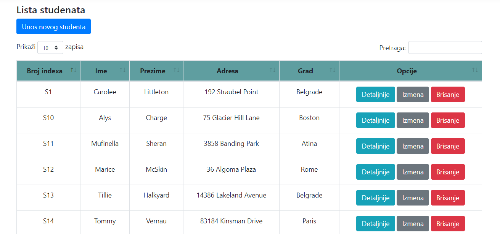
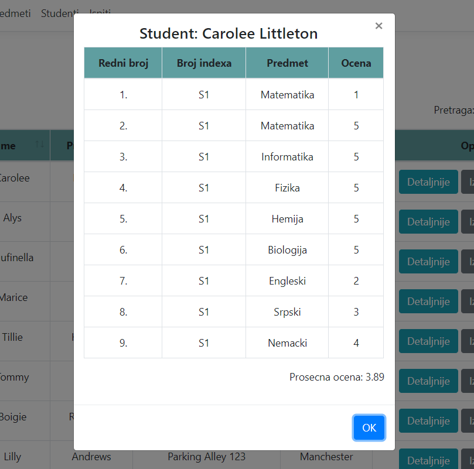

Application developed in ASP.NET Core 3.1 with CRUD operations for managing students exams and master-detail page for Student.

# Test section: 
 - 39 unit tests
 - 17 Automated UI tests
 - 4 integration tests

# Technologies used:
- ASP.NET Core 3.1
- XUnit
- Moq
- Selenium
- Repository Design pattern for increasing testability of the project
- Datatables plug-in
- BootBox.js

 
 
 - BootBox.js for managing master detail page
  
 
